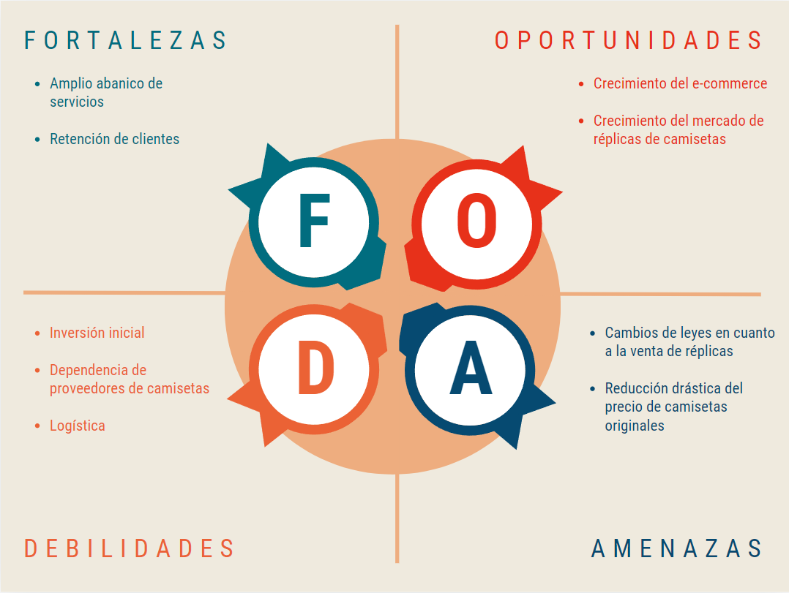
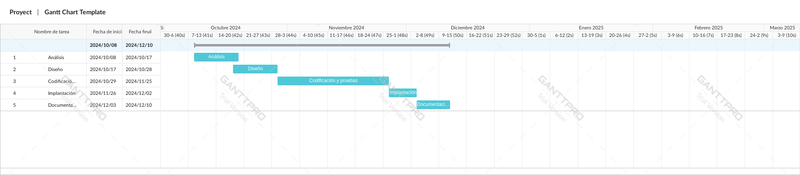

# Anteproxecto fin de ciclo

- [Anteproxecto fin de ciclo](#anteproxecto-fin-de-ciclo)
  - [1- Descripción del proyecto](#1--descripción-del-proyecto)
  - [2- Empresa](#2--empresa)
    - [2.1- Idea de negocio](#21--idea-de-negocio)
    - [2.2- Justificación de la idea](#22--justificación-de-la-idea)
    - [2.3- Segmento de clientes](#23--segmento-de-clientes)
    - [2.4- Competencia](#24--competencia)
    - [2.5- Propuesta de valor](#25--propuesta-de-valor)
    - [2.6- Forma jurídica](#26--forma-jurídica)
    - [2.7- Inversiones](#27--inversiones)
      - [2.7.1- Costes](#271--costes)
      - [2.7.2- Ingresos](#272--ingresos)
    - [2.8- Viabilidad](#28--viabilidad)
      - [2.8.1- Viabilidad técnica](#281--viabilidad-técnica)
      - [2.8.2 - Viabilidad económica](#282---viabilidad-económica)
      - [2.8.3- Conclusión](#283--conclusión)
  - [3- Requerimientos técnicos](#3--requerimientos-técnicos)
  - [4- Planificación](#4--planificación)

## 1- Descripción del proyecto

El proyecto consiste en una plataforma para que los aficionados del fútbol puedan, principalmente, comprar réplicas de camisetas de equipos, tanto actuales como retro. Además, la idea es ampliar dicha plataforma con otras secciones que consistan en consultar partidos y clasificaciones en directo o crear "ligas fantasy".
*Una liga fantasy consiste en una competición entre amigos en la que cada uno crea un equipo de jugadores reales y estos reciben una puntuación según su rendimiento en la vida real. La forma de monetizar este servicio es mediante pagos premium para disfrutar de mas personalización en dichas competiciones y mediante publicidad.*

El objetivo es crear una plataforma online en la que los aficionados al fútbol vean satisfechas todas sus necesidades en cuanto a su hobby se refiere.

## 2- Empresa

### 2.1- Idea de negocio

La idea se basa en la venta de réplicas de camisetas de fútbol y la oferta de otros servicios como consultar estadísticas en directo. El valor añadido radica en la amplia variedad de productos y servicios ofrecidos en esta plataforma.

### 2.2- Justificación de la idea

Esta idea surge de que actualmente la demanda de réplicas de camisetas de fútbol retro está en aumento y de que no hay ninguna tienda física u online bien posicionada en el mercado. Además, gran parte de los aficionados del fútbol utilizan otros servicios como los mencionados anteriormente (aplicaciones para consultar resultados de partidos en directo y ligas fantasy) y no hay ninguna plataforma que cubra todas esas necesidades de forma individual.

### 2.3- Segmento de clientes

Mi público objetivo son principalmente los aficionados del fútbol con la capacidad económica de gastar dinero en camisetas ya que, usualmente, el que compra camisetas de fútbol no solo compra una vez si no que también es coleccionista. Por otra parte el objetivo de clientes de otras secciones como consultar estadísticas en directo son aficionados de todas las edades y nivel económico (en este caso serían usuarios).

### 2.4- Competencia

Como competidores principales estarían las webs de venta de réplicas, de las cuáles ninguna está claramente bien posicionada respecto al resto y ninguna cubre tantas necesidades como lo hace este proyecto. Por otro lado, esas otras necesidades que cubre, sí tienen fuertes competidores y bien posicionados como puede ser el caso de FlashScore, OneFootball o Sofascore en el caso de proveer estadísticas en directo y prensa deportiva como Marca, As, MundoDeportivo o Relevo en el caso de "ligas fantasy".

### 2.5- Propuesta de valor

Mi propuesta de valor se basa en:

- **Imagen de marca**: Logrando asociar "calidad" y "fiabilidad" a una tienda de réplicas, algo inexistente en el mercado.
- **Variedad:** Amplio catálogo de réplicas de camisetas de fútbol, desde las más clásicas hasta las más actuales.
- **Fidelización:** Centralizando todos los servicios que consume en aficionado del fútbol en una sola plataforma.
  
### 2.6- Forma jurídica

La forma jurídica más adecuada sería una Sociedad Limitada, ya que permite un crecimiento a largo plazo, la inversión inicial requerida no es desorbitada (3000€) y sus ventajas fiscales como el impuesto de sociedades (menor al IRPF) o ventajas para empresas nuevas.

### 2.7- Inversiones

- **Desarrollo de la plataforma:** 20 000€ en salarios (14 pagas x 1 trabajador) y 3 000€ en equipos informáticos
- **Publicidad** *(campaña redes sociales)* **:** 7 000€
- **Stock inicial de productos:** 7900€ *(7.90€/ud.)*
  - Camisetas: 1000 unidades x 5€ - 5000€
  - Flete marítimo: 2000€
  - Aduanas origen: 200€
  - Aduanas destino: 400€
  - Transporte a almacén: 300€

#### 2.7.1- Costes

- **Gastos fijos:** *(3 262.50€/mes)*
  - Hosting web: 50€
  - API's externas: 50€
  - Teléfono + Internet: 100€
  - Almacén-Oficina: 500€
  - Salarios: 2500€
  - Amortizaciones: 62.50€ (durante 60 meses)

- **Gastos variables:** *(11.50€)*
  - Camiseta: 7.9€
  - Embalaje y envío: 0.20€ +3€
  - Comisiones por pago: 2% del pago + 0.25€

#### 2.7.2- Ingresos

 Precio camiseta:  20€
 Coste camiseta: 11.50€
 Margen de beneficio: 8.50€

Umbral de rentabilidad: 384 unidades mensuales vendidas

- **Previsión de ventas:** *(cifras en unidades)*

||Enero |Febrero |Marzo |Abril |Mayo |Junio |Julio |Agosto |Septiembre |Octubre |Noviembre |Diciembre|
|:-|:-:|:-:|:-:|:-:|:-:|:-:|:-:|:-:|:-:|:-:|:-:|:-:|
|**2025**|50|100|100|100|100|200|200|500|500|500|500|500|
|**2026**|500|500|500|500|500|1000|1000|1500|1500|1500|1500|1500|
|**2027**|1500|1500|1500|1500|1500|1500|1500|2000|2000|2000|2000|2000|
|**2028**|2000|2000|2000|2000|2000|3000|3000|3000|3000|3000|3000|3000|

Crecimientos importantes en los meses de agosto/septiembre debido al inicio de la temporada y en junio/julio de 2026 y 2028 debido al inicio del Mundial y Eurocopa respectivamente.

### 2.8- Viabilidad

#### 2.8.1- Viabilidad técnica

**Requisitos técnicos:**

- **Desarrollo del software**
- **Proveedores:** Tanto de camisetas (como Putian Jizhi Trade Co., Ltd) como de estadísticas (como Opta, Stats Perform, etc.).

**Impedimentos técnicos:**

- **Complejidad del software**
- **Mantenimiento**
- **Escalabilidad:** La plataforma deberá estar preparada tanto técnicamente para soportar un aumento significativo de usuarios como logísticamente frente a un aumento de ventas.

En cuanto al aspecto técnico, el proyecto es viable debido a que el equipo de desarrollo tiene los conocimientos para llevarlo a cabo y un plan de escalabilidad definido para hacer frente a un crecimiento repentino. Por otra parte ya se han encontrado e identificado a los proveedores necesarios para realizar la actividad económica.

#### 2.8.2 - Viabilidad económica

Teniendo en cuenta la previsión de ventas anteriormente mencionada, el margen de beneficio unitario de 8.50€ y los costes fijos, alcanzaría y superaría el umbral de rentabilidad a partir del primer año/9 meses.

#### 2.8.3- Conclusión

  En conclusión, el proyecto es viable tanto técnica como económicamente hablando con una inversión inicial cercana a los 38 000 euros y dejaría de dar pérdidas antes del primer año.

## 3- Requerimientos técnicos
  
- **Frontend:** React para crear la interfaz de usuario.
- **Backend:** Laravel para el desarrollo de una API REST.
- **Base de datos:** MariaDB para almacenar los datos de camisetas, usuarios y pedidos.
- **Cloud platform:** VPS de Hostinger para alojar la aplicación y escalar según sea necesario.
- **Pasarela de pago:** Stripe como pasarela de pago.

## 4- Planificación

