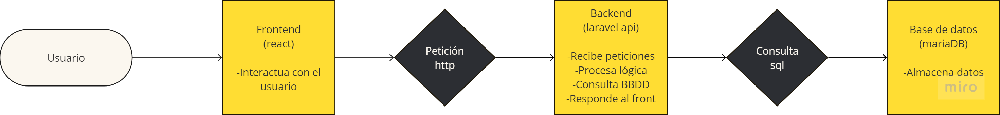

# FASE DE DESEÑO

  

- [FASE DE DESEÑO](#fase-de-deseño)

- [1- Diagrama da arquitectura](#1--diagrama-da-arquitectura)

- [2- Casos de uso](#2--casos-de-uso)

- [3- Diagrama de Base de Datos](#3--diagrama-de-base-de-datos)

- [4- Deseño de interface de usuarios](#4--deseño-de-interface-de-usuarios)

## 1- Diagrama da arquitectura

Hay 3 componentes principales, el *frontend* en React que se encarga de interactuar con el usuario, el *backend* en una api en Laravel que se encarga de recibir peticiones del *frontend* y una base de datos mariaDB que se encarga de almacenar los datos.

Diagrama de casos de uso
>  - 

## 2- Casos de uso

Diagrama de casos de uso
>  - 

## 3- Diagrama de Base de Datos

Modelo Entidad-Relación
>  - 

Modelo Relacional
>  - 

## 4- Deseño de interface de usuarios

Prototipo en figma:

https://www.figma.com/proto/FytukNCsbBHkR7oJKZpEJ2/Camikakis?node-id=185-153&node-type=frame&t=H3X9zCY1yNbbbjk3-8&scaling=min-zoom&content-scaling=fixed&page-id=0%3A1&starting-point-node-id=185%3A153&hide-ui=1

En la parte del marcador, clicar en la primera liga, para ver un partido clic en el primer partido de la jornada 7 y para ver 1 equipo en el primer equipo de la clasificación.

La parte que se va a implementar es la de **tienda** y como mejora futura y en caso de tener tiempo la de **marcador**.